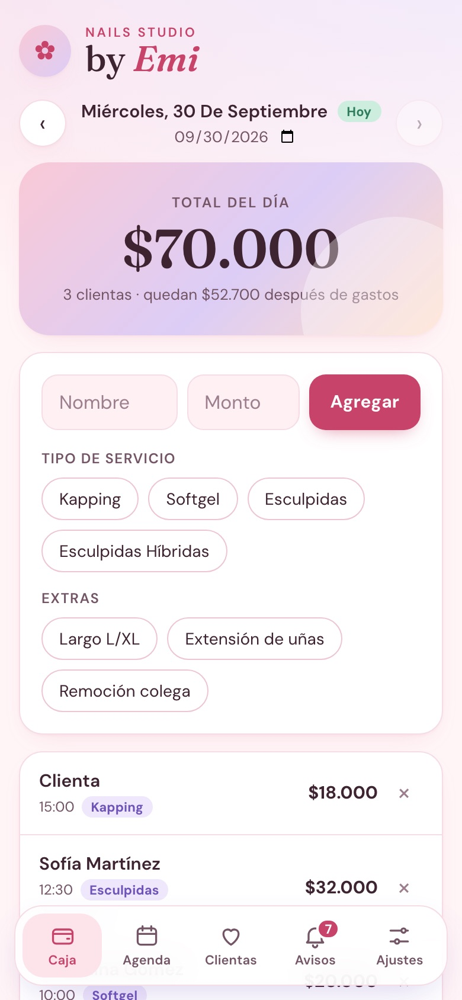
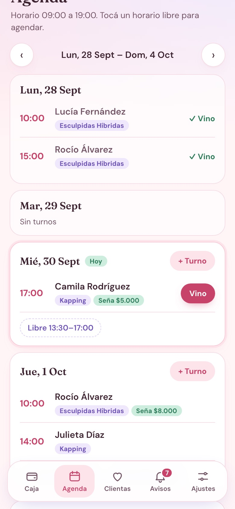
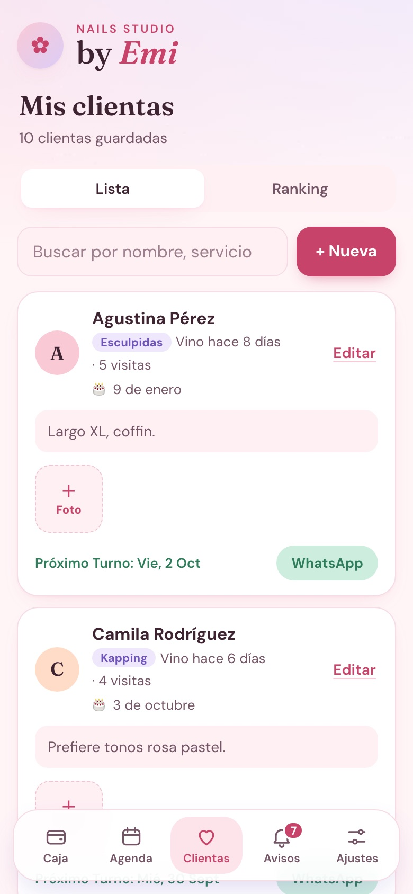
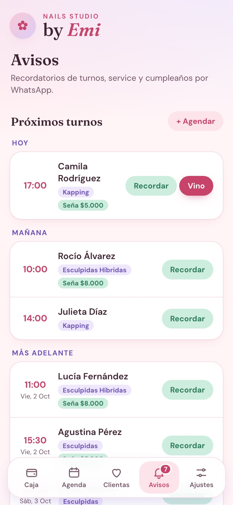
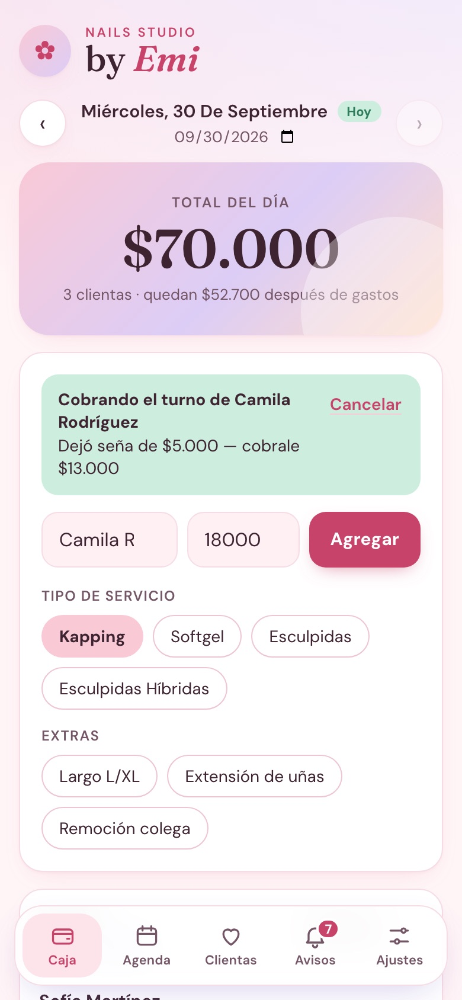
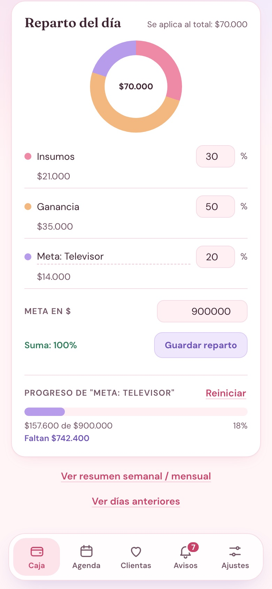
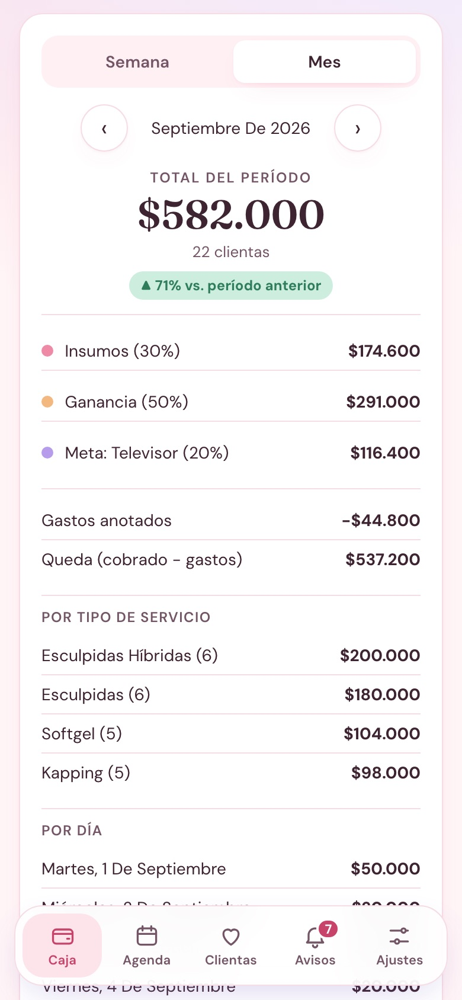
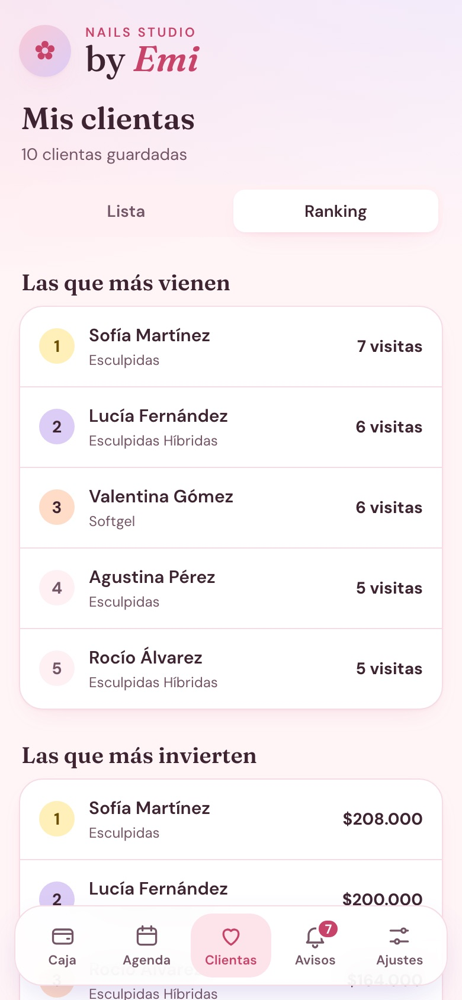

# by Emi · Caja, agenda y clientas de un salón de uñas

PWA hecha a medida para un salón de uñas real. Reemplaza el cuaderno y las notas del celular: cada cobro se anota en segundos, el total del día se reparte solo entre insumos, ganancia y una meta de ahorro, la agenda muestra los huecos libres de la semana y los recordatorios de turno, de service y de cumpleaños salen por WhatsApp con un toque.

Se instala en el celular como una app ("Agregar a pantalla de inicio"), sin pasar por ninguna tienda, y todo queda detrás de una clave de acceso. El diseño es pastel y pensado para usarse con una mano entre clienta y clienta: barra de pestañas abajo, botones grandes y montos en pesos argentinos.

En producción: **[byemi.vercel.app](https://byemi.vercel.app)**

<p align="center">
  
  
  
  
</p>

<p align="center">
  
  
  
  <br>
  <sub>Cobro desde un turno, reparto con meta de ahorro, resumen mensual y ranking de clientas (datos de ejemplo).</sub>
</p>

---

## Qué hace

La app tiene cinco pestañas: **Caja**, **Agenda**, **Clientas**, **Avisos** y **Ajustes**.

**Caja**

| | |
|---|---|
| **Cobros del día** | Nombre de la clienta (opcional), tipo de servicio, extras y monto. Si hay precios cargados, el monto se completa solo (servicio + extras). Se navega día por día o se elige una fecha. |
| **Gastos** | Esmaltes, limas, lo que sea: se anotan aparte y se descuentan en el resumen. |
| **Reparto del día** | El total se divide en **Insumos**, **Ganancia** y una tercera parte con nombre propio (por ejemplo "Meta: Televisor"). Los porcentajes se editan y tienen que sumar 100 %. Un gráfico de anillo muestra cuánto va a cada lado. |
| **Meta de ahorro** | Se le pone un monto a la tercera parte y aparece una barra de progreso con lo acumulado y lo que falta. Se puede reiniciar cuando se cumple. |
| **Resumen** | Semanal o mensual: total cobrado, comparación con el período anterior, gastos, lo que queda (cobrado − gastos), desglose por tipo de servicio y por día. |
| **Historial** | Lista de todos los días con cobros, para volver a cualquiera. |

**Agenda**

| | |
|---|---|
| **Semana a la vista** | De lunes a domingo, con los turnos de cada día y los días que no se trabaja marcados. |
| **Horarios libres** | Calcula los huecos de cada día según el horario de trabajo y la duración de cada servicio (un Kapping ocupa 90 min, unas Esculpidas 120). Tocar un hueco abre un turno nuevo en ese horario. |
| **Turnos con seña** | Cada turno lleva clienta, día, hora, servicio y la seña que dejó. Se puede crear la clienta desde el mismo turno. |
| **"Vino" → cobrar** | Cuando la clienta llega, el turno pasa a la Caja con el nombre y el servicio cargados, y avisa cuánto falta cobrar descontando la seña. Al guardar el cobro, el turno queda como atendido. Si se borra el cobro, vuelve a pendiente. |

**Clientas**

| | |
|---|---|
| **Fichas** | Nombre, WhatsApp, servicio habitual, cumpleaños (día y mes, sin año) y notas: colores que le gustan, largo, forma, alergias. |
| **Fotos de trabajos** | Galería por clienta para recordar qué se hizo. Las fotos se achican en el celular antes de subirse (1400 px, JPEG). |
| **Historial automático** | Última visita, cantidad de visitas y total gastado se calculan solos cruzando las fichas con los cobros de la Caja. |
| **Ranking** | Las que más vienen, las que más invierten y las que hace más de 60 días que no vienen ni tienen turno, con un botón para escribirles. |
| **Búsqueda** | Por nombre, servicio o nota. Desde la ficha se agenda un turno directo. |

**Avisos**

| | |
|---|---|
| **Recordatorio de turno** | Turnos de hoy y mañana que todavía no tienen aviso. Un toque abre WhatsApp con el mensaje armado y el turno queda marcado como recordado. |
| **Les toca service** | Clientas que pasaron N días desde la última visita (21 por defecto) y no tienen turno. |
| **Cumpleaños** | Las que cumplen hoy y en los próximos 7 días, con un saludo listo (y un descuento, si se quiere). |
| **Mensajes editables** | Los tres textos se personalizan con variables: `{nombre}`, `{servicio}`, `{dia}`, `{hora}`, `{semanas}`. |
| **Contador** | La pestaña muestra un globito con la cantidad de avisos pendientes. |

**Ajustes**

| | |
|---|---|
| **Lista de precios** | Servicios (precio y duración) y extras (precio). En 0, el monto no se autocompleta. |
| **Horario de trabajo** | Hora de entrada y salida, y días que se trabaja. Lo usa la Agenda para calcular los huecos. |
| **Clave de acceso** | Se crea la primera vez que se abre la app. Cambiarla cierra la sesión en los demás dispositivos. |
| **Backup** | Planillas CSV (ingresos, gastos, clientas, turnos) que abren bien en Excel en español (separador `;` y acentos), y un backup completo en JSON. |

**Seguridad y privacidad**

- Toda la API pide sesión; la única ruta abierta es la de ingreso.
- La clave se guarda con `scrypt` y sal aleatoria; las sesiones, como hash SHA-256 del token (nunca el token en sí).
- Límite de 10 intentos fallidos de clave cada 15 minutos por IP.
- Las fotos se sirven solo con sesión válida y con nombres de archivo validados.
- El backup JSON no incluye la clave.

## Cómo funcionan los recordatorios por WhatsApp

No hace falta la API de WhatsApp Business ni ningún servicio pago. La app arma un link `https://wa.me/<número>?text=<mensaje>` con el mensaje ya completado; al tocarlo se abre WhatsApp en el celular con el chat de la clienta y el texto listo para mandar.

Los números se normalizan para Argentina: si se cargan como `11 2345 6789` o `011 2345-6789`, la app les agrega el `549` adelante.

## Estructura

```
backend/                      API REST (Express + SQLite)
  server.js                   arranque, CORS y rutas
  auth.js                     clave, sesiones y límite de intentos
  db.js                       ⭐ esquema SQLite, migraciones automáticas y config por defecto
  routes/
    entries.js                cobros de la Caja (y marcar el turno como atendido)
    expenses.js               gastos
    summary.js                resumen semanal, mensual e histórico
    clients.js                fichas (con visitas y total gastado calculados)
    appointments.js           turnos
    photos.js                 fotos de clientas en disco
    config.js                 reparto, precios, horario y mensajes
    export.js                 CSV para Excel y backup JSON
  Dockerfile                  imagen para publicar el backend

frontend/                     PWA (React + Vite)
  index.html                  metadatos de PWA (iOS y Android)
  public/
    manifest.webmanifest      nombre, colores e íconos de la app instalada
    inspo/                    fotos de trabajos para la tira del inicio
  src/
    App.jsx                   clave, pestañas y estado compartido
    Caja.jsx                  cobros, gastos, reparto, meta y resumen
    Agenda.jsx                semana, horarios libres y turnos
    Clientas.jsx              fichas, fotos y ranking
    Recordatorios.jsx         avisos de turno, service y cumpleaños
    Ajustes.jsx               precios, horario, clave y backup
    Login.jsx                 crear clave / ingresar
    api.js                    cliente de la API (token en localStorage)
    utils.js                  fechas, plata, WhatsApp y compresión de fotos
    inspo.js                  lista de fotos e Instagram del salón
    styles.css                ⭐ sistema visual pastel

docs/                         capturas para este README
```

Hecho con **React 18** y **Vite 5** en el frontend, y **Node.js**, **Express** y **SQLite** ([better-sqlite3](https://github.com/WiseLibs/better-sqlite3)) en el backend. Sin frameworks de UI ni librerías de gráficos: el anillo del reparto es un `conic-gradient` de CSS y los íconos son SVG propios.

### Datos

| Tabla | Qué guarda |
|---|---|
| `entries` | Cobros: fecha, hora, clienta, servicio, extras y monto |
| `expenses` | Gastos: fecha, detalle y monto |
| `clients` | Fichas de clientas |
| `appointments` | Turnos, con seña y el cobro que los cerró |
| `client_photos` | Fotos de cada clienta (el archivo vive en `DATA_DIR/photos/`) |
| `config` | Reparto, precios, horario, mensajes y la clave (hasheada) |
| `sessions` | Sesiones abiertas (hash del token) |

Las tablas se crean solas al arrancar, y las columnas nuevas se agregan a bases de versiones anteriores sin perder datos.

## Verlo en tu compu

Necesitás **Node.js 20 o superior**. Son dos procesos: el backend en el puerto 3001 y el frontend en el 5173.

```bash
# terminal 1
cd backend
npm install
npm run dev

# terminal 2
cd frontend
npm install
npm run dev
```

Después abrí <http://localhost:5173>. La primera vez la app pide crear una clave.

Como Vite escucha en toda la red (`host: true`), también se puede abrir desde el celular en la misma wifi con la IP de la compu, por ejemplo `http://192.168.0.10:5173`. En ese caso el frontend tiene que apuntar al backend por esa IP (ver `VITE_API_URL`).

### Variables de entorno

**Backend**

| Variable | Para qué |
|---|---|
| `PORT` | Puerto de la API (por defecto `3001`). |
| `DATA_DIR` | Carpeta de la base SQLite (`control-unas.db`) y de las fotos (`photos/`). Por defecto `backend/data/`. En producción tiene que ser un **disco persistente**. |
| `APP_PASSWORD` | Opcional. Clave inicial. Si no se define, la app pide crearla la primera vez que se abre. Solo se usa si todavía no hay clave. |

**Frontend** (se leen al hacer el build)

| Variable | Para qué |
|---|---|
| `VITE_API_URL` | URL del backend sin barra final, por ejemplo `https://byemi-api.tudominio.com`. Por defecto `http://localhost:3001`. |

## Personalizar

- **Fotos del inicio:** guardá imágenes en `frontend/public/inspo/` como `01.jpg` … `06.jpg` (o cambiá la lista en `src/inspo.js`). Las que no existen se ocultan solas.
- **Instagram:** completá `INSTAGRAM_URL` e `INSTAGRAM_HANDLE` en `src/inspo.js` y aparece el link debajo de las fotos.
- **Íconos de la app:** agregá `icon-192.png` e `icon-512.png` en `frontend/public/` (los pide el `manifest.webmanifest`).
- **Servicios, precios, horario y mensajes:** se cambian desde la pestaña **Ajustes** y **Avisos**, sin tocar código.

## Publicar

### Backend (Docker con disco persistente)

SQLite y las fotos viven en archivos, así que el backend necesita un servidor con disco que no se borre: Railway, Render, Fly.io o un VPS. No sirve en plataformas serverless.

1. Publicá la carpeta `backend/` con el `Dockerfile` incluido.
2. Montá un volumen persistente y apuntá `DATA_DIR` a él (por ejemplo `/data`).
3. Opcional: definí `APP_PASSWORD`.
4. Revisá que responda `GET /api/health` → `{ "ok": true }`.

El backend confía en el primer proxy (`trust proxy`) para que el límite de intentos vea la IP real.

### Frontend (Vercel)

1. Importá el repo en Vercel con **Root Directory** `frontend` (Vite se detecta solo).
2. En **Settings → Environment Variables** cargá `VITE_API_URL` con la URL del backend.
3. Push a `main`: Vercel publica solo.

Para instalarla en el celular: abrir la URL en Safari o Chrome → **Compartir / Menú → Agregar a pantalla de inicio**.

### Backups ✅

- Desde **Ajustes → Backup**, descargar una vez por semana el backup completo (y las planillas si se quieren mirar en Excel).
- En el servidor, respaldar periódicamente `DATA_DIR` entero: la base y la carpeta `photos/` (las fotos no van en el JSON).

## API

Todas las rutas, salvo `/api/health` y `/api/auth/*`, piden `Authorization: Bearer <token>`.

| Método | Ruta | Qué hace |
|---|---|---|
| `GET` | `/api/auth/status` | Si hay clave creada y si la sesión es válida |
| `POST` | `/api/auth/setup` · `/login` · `/logout` · `/change` | Crear clave, entrar, salir, cambiar clave |
| `GET` `POST` | `/api/entries/:date` | Cobros de un día / agregar uno |
| `DELETE` | `/api/entries/id/:id` | Borrar un cobro (el turno vuelve a pendiente) |
| `GET` `POST` | `/api/expenses/:date` | Gastos de un día / agregar uno |
| `GET` | `/api/summary/week/:date` · `/month/:date` · `/alltime` | Resúmenes |
| `GET` `POST` `PUT` `DELETE` | `/api/clients` | Fichas de clientas |
| `POST` `DELETE` | `/api/photos` | Subir (base64) o borrar fotos |
| `GET` `POST` `PUT` `DELETE` | `/api/appointments` | Turnos; `POST /:id/reminded` marca el aviso |
| `GET` `PUT` | `/api/config/split` · `/catalog` · `/agenda` · `/reminders` | Reparto, precios, horario, mensajes |
| `GET` | `/api/export/:tabla.csv` · `/backup.json` | Exportar |

## Próxima etapa

- Funcionar sin conexión (service worker) y sincronizar al volver la señal.
- Restaurar un backup JSON desde Ajustes.
- Varias profesionales en el mismo salón, cada una con su caja y su reparto.
- Vincular los cobros a la ficha por id, no por nombre.
- Envío automático de recordatorios (API de WhatsApp Business).

## Sobre el proyecto

Proyecto real hecho a medida para un cliente (salón de uñas), desarrollado en solitario de punta a punta: relevamiento con la dueña, arquitectura, desarrollo, despliegue y soporte.
